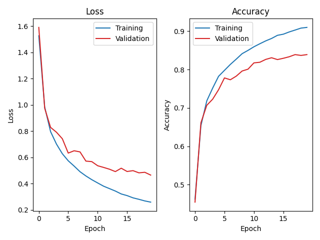
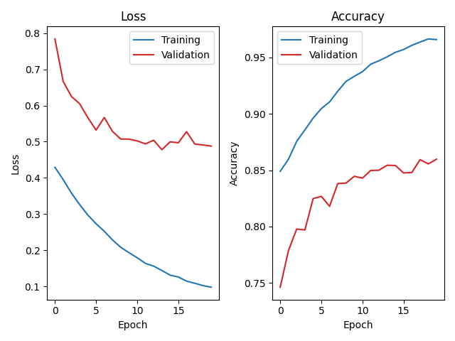

# Lab 1 Homework Template

### 1. Model Architecture
I built my model based on the requirement of the assignment which look exaclty like this:
| Layer   | Type            |
|---------|----------------|
| `Conv1`   | Conv2D (3 → 64) |
| `MaxPool` | 2×2 Pooling     |
| `Conv2`   | Conv2D (64 → 192) |
| `MaxPool` | 2×2 Pooling     |
| `Conv3`   | Conv2D (192 → 384) |
| `Conv4`   | Conv2D (384 → 256) |
| `Conv5`   | Conv2D (256 → 256) |
| `MaxPool` | 2×2 Pooling     |
| `Flatten` | -              |
| `FC6`     | Linear (256\*fmap_size² → 256) |
| `FC7`     | Linear (256 → 128) |
| `FC8`     | Linear (128 → num_classes) |

And the way I implemented it is to make each layer a function in the VGG class, while Maxpool and ReLu is intergrated into each layer of convolution or fully connection.

In terms of Python code, it turned out to be like:
```python
class VGG(nn.Module):
    """ Implement your model here """
    def __init__(self, in_channels=3, in_size=32, num_classes=10) -> None:
        super().__init__()

        self.conv1 = nn.Sequential(
            nn.Conv2d(3,  64, kernel_size=3, stride=1, padding=1),
            nn.BatchNorm2d(64),
            nn.ReLU(),

            nn.MaxPool2d(kernel_size=2, stride=2),
        )

        self.conv2 = nn.Sequential(
            nn.Conv2d(64,  192, kernel_size=3, stride=1, padding=1),
            nn.BatchNorm2d(192),
            nn.ReLU(),

            nn.MaxPool2d(kernel_size=2, stride=2),
        )

        self.conv3 = nn.Sequential(
            nn.Conv2d(192,  384, kernel_size=3, stride=1, padding=1),
            nn.BatchNorm2d(384),
            nn.ReLU(),
        )

        self.conv4 = nn.Sequential(
            nn.Conv2d(384,  256, kernel_size=3, stride=1, padding=1),
            nn.BatchNorm2d(256),
            nn.ReLU(),
        )

        self.conv5 = nn.Sequential(
            nn.Conv2d(256,  256, kernel_size=3, stride=1, padding=1),
            nn.BatchNorm2d(256),
            nn.ReLU(),

            nn.MaxPool2d(kernel_size=2, stride=2),
        )

        self.fc6 = nn.Sequential(
            nn.Linear(4*4*256, 256),
            nn.ReLU(),
        )

        self.fc7 = nn.Sequential(
            nn.Linear(256, 128),
            nn.ReLU(),
        )

        self.fc8 = nn.Sequential(
            nn.Linear(128, 10),
            nn.ReLU(),
        )

    def forward(self, x: torch.Tensor) -> torch.Tensor:
        x = self.conv1(x)
        x = self.conv2(x)
        x = self.conv3(x)
        x = self.conv4(x)
        x = self.conv5(x)
        x = torch.flatten(x, start_dim=1)
        x = self.fc6(x)
        x = self.fc7(x)
        x = self.fc8(x)
        return x

if __name__ == "__main__":
    model = VGG()
    inputs = torch.randn(1, 3, 32, 32)
    print(model)

    from torchsummary import summary

    summary(model, (3, 32, 32), device="cpu")
```

### 2. Loss/Epoch and Accuract/Epoch Plotting

  
  

### 3. Accuracy Tuning

| Hyperparameter | Loss function | Optimizer | Scheduler | Weight decay or Momentum | Epoch |
| -------------- | ------------- | --------- | --------- | ------------------------ | ----- |
| Value          |CrossEntropyLoss| Adam     |ExponentialLR|                        | 20    |

### 4. Explain how the Power-of-Two Observer in your QConfig is implemented.

#### 1. Explain how to caluclate ***scale*** and ***zero-point***.
In quantization, we map floating-point numbers to a lower precision (e.g., int8). This requires two parameters:  

* Scale: Determines the step size between quantized values.  
* Zero-point: Aligns zero in floating-point to a quantized integer value.  

Formulas:
* Scale:
$$
\begin{align}
scale &= \frac{max\_range}{127}
\end{align}
$$

Here, `max_range` is the maximum absolute value of the observed data, and `127` is the maximum positive value for int8.  

* Zero-point:  
Since the code uses a symmetric quantization scheme (`torch.per_tensor_symmetric`), the zero-point is either `0` for signed int8 (`torch.qint8`) or `127` for unsigned int8 (`torch.quint8`).  

In the code:  
```python
min_abs, max_abs = abs(min_val), abs(max_val)
max_range = max(min_abs, max_abs)
scale = max_range / 127
zero_point = 0 if self.dtype == torch.qint8 else 127
```
#### 2. Explain how ```scale_approximate()``` function in ```class PowerOfTwoObserver()``` is implemented.
This function adjusts the scale to a power-of-two value for more efficient computations, especially on hardware that handles bit shifts faster than multiplications.  

How it works:  

   1. Edge Case:  
If `scale` is `0`, it returns $2^{-max\_shift\_amount}$ to avoid division by zero.  

   2. Calculate Exponent:  
Uses `math.log2(scale)` to convert the scale to a logarithmic base-2 representation.  

   3. Clamping:  
Limits the exponent to a range of `[-max_shift_amount, max_shift_amount]` to prevent excessively large or small values.  

   4. Return Power-of-Two:  
Computes $2^{exp\_q}$ to get the adjusted scale as a power of two.  

Code:  
```python
def scale_approximate(self, scale: float, max_shift_amount=8) -> float:
    if scale == 0:
        return 2 ** -max_shift_amount  # Prevent division by zero

    exp = math.log2(scale)
    exp_q = max(-max_shift_amount, min(exp, max_shift_amount))  # Clamp shift range

    return 2 ** exp_q  # Return the closest power-of-two scale
```
#### 3. When writing ```scale_approximate()```, is there a possibility of overflow? If so, how can it be handled?  

Yes, overflow is possible in these scenarios:  

1. Extremely large `scale` values:  
Could lead to a very large exponent, causing overflow in `2 ** exp_q`.  

2. Extremely small `scale` values:  
Could cause underflow, leading to `0` which might not be handled well by hardware.  

How to handle it:  
* Clamping: Already implemented in the code:  
```python
exp_q = max(-max_shift_amount, min(exp, max_shift_amount))
```
This limits the exponent to a safe range.  

* Additional Safeguards: Could include:
```python
exp_q = min(max(exp_q, -max_shift_amount), max_shift_amount)
```
* Data type checks: Ensuring that the scale stays within the representable range of the data type used (`float32`).

So, the existing code handles overflow quite well through clamping.  


### 5. Comparison of Quantization Schemes

Given a **linear layer (128 → 10)** with an input shape of 1×128 and an output shape of 1×10, along with the energy costs for different data types, we will use the provided table to estimate the total energy consumption for executing such a fully connected layer during inference under the following two scenarios:

1. Full precision (FP32)
2. 8-bit integer, power-of-2, static, uniform symmetric quantization
    - activation: UINT8
    - weight: INT8


| Operation                        | Energy consumption (pJ)    |
| -------------------------------- | -------------------------- |
| FP32 Multiply                    | 3.7                        |
| FP32 Add                         | 0.9                        |
| INT32 Add                        | 0.1                        |
| INT8 / UINT8 Multiply            | 0.2                        |
| INT8 / UINT8 Add                 | 0.03                       |
| Bit Shift                        | 0.01                       |


#### Hint

- The energy consumption of INT32 addition should also be considered. Each INT32 addition consumes 0.1 pJ of energy, as depicted in the figure of the lab hanout.
- Since we are using **static quantization** in this lab, the power-of-two scaling factors for input, weight, and output can fused into **ONE** integer before the inference.
- The summation is computed under **INT32** rather than INT16.

You can ignore the energy consumption of type casting, memory movement, and other operations not listed in the table.

You can refer to the following formula previously-mentioned in the lab handout:

$$
\tag{6}
\bar y_i = \left( \text{ReLU}(\bar b_i + \sum_j (\bar x_j - 128) \cdot \bar w_{ji}) \gg \overbrace{(c_x + c_w - c_y)}^{\text{pre-computed offline}} \right) + 128
$$

#### Calculation Process

#### 1. Before Quantization (FP32)  
Matrix Multiplication Energy Cost (FP32)  
* Input shape: $1 \times 128$  
* Output shape: $1 \times 10$  
* Each output neuron involves a dot product with 128 multiplications and 127 additions.  

Total FP32 Multiply Operations:  
$$
128 \times 10 = 1280
$$

Energy per FP32 Multiply: 3.7 pJ  
Total Energy for FP32 Multiply:  
$$
1280 \times 3.7 = 4736\ pJ
$$

Total FP32 Add Operations:  
$$
127 \times 10 = 1270
$$
Energy per FP32 Add: 0.9 pJ  
Total Energy for FP32 Add:  
$$
1270 \times 0.9 = 1143\ pJ
$$
Total Energy for FP32 Matrix Multiplication:  
$$
4736 + 1143 = 5879\ pJ
$$

#### 2. After Quantization (INT8 / UINT8)
Quantized Matrix Multiplication Energy Cost  
Total INT8 Multiply Operations:  
$$
128 \times 10 = 1280
$$
Energy per INT8 Multiply: 0.2 pJ  
Total Energy for INT8 Multiply:  
$$
1280 \times 0.2 = 256\ pJ
$$
Total INT32 Add Operations (for accumulation):  
$$
127 \times 10 = 1270
$$
Energy per INT32 Add: 0.1 pJ  
Total Energy for INT32 Add:  
$$
1270 \times 0.1 = 127\ pJ
$$
Total INT8 Add Operations (for bias addition):  
$$
10
$$
Energy per INT8 Add: 0.03 pJ  
Total Energy for INT8 Add:  
$$
10 \times 0.03 = 0.3\ pJ
$$
Bit Shift Operations (Power-of-2 Quantization):  
$$
10
$$
Energy per Bit Shift: 0.01 pJ  
Total Energy for Bit Shifts:  
$$
10 \times 0.01 = 0.1\ pJ
$$
Total Energy for Quantized Matrix Multiplication:  
$$
256 + 127 + 0.3 + 0.1 = 383.4\ pJ
$$

|                         | Before quantization (FP32) | After quantization |
| ----------------------- | ---- | --------- |
| Energy consumption (pJ) |   5879   |     	383.4      |
So, the energy consumption significantly reduces after quantization! 🚀