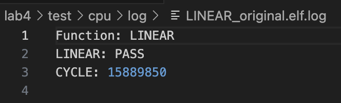

# Lab 4 Homework Template

## PASS Screenshot
### DLA (total 30%)
##### Testbench `dla0` 7.5%

##### Testbench `dla1` 7.5%

##### Testbench `dla2` 7.5%

##### Testbench `dla3` 7.5%

### CPU (total 60%)
Each `original version` operation contributes **7.5** points to the overall score.
Each `Improved version` operation is based on **the degree of cycle reduction**, with a full score of 7.5 points.
Please refer to the section below for detailed evaluation criteria.
##### `qconv2d_relu_maxpool_cpu`
**Original**  
  
**Improve**  
  
##### `qconv2d_relu_cpu`
**Original**  
  
**Improve**  
  
##### `qlinear_relu_cpu`
**Original**  
  
**Improve**  
  
##### `qlinear_cpu`
**Original**  
  
**Improve**  
  

## Performance in CPU
Please fill in the number of execution cycles and the results from the Valgrind analysis.
| Function     |            D refs      |        D1 miss      |   Cycle (roughly), depend on server status  |
|------------------|--------------------|---------------------|-----------|
|`CONV_original`         |    2,997,008,341    |      60,605      |     1,281,916,697  |
|`CONV_improve`          |    2,068,142,891    |      116,127     |     734,844,523    |
|`CONV_MAX_original`     |    2,997,008,354    |      60,876      |     1,283,853,609  |
|`CONV_MAX_improve`      |    2,068,281,141    |      114,124     |     734,293,615    |
|`LINEAR_original`       |    17,894,714     |     19,781       |     15,889,850     |
|`LINEAR_improve`        |    12,847,241     |     18,472       |     12,712,023     |
|`LINEAR_RELU_original`  |    17,896,261     |     19,783       |     16,005,284     |
|`LINEAR_RELU_improve`   |    12,848,020     |     18,477       |     5,134,826      |

**Scoring Criteria for every improved operation:**

| Cycles reduced ratio  | score | Note                  |
| -------------------------------- | ----- | --------------------- |
| <20%                             | 2.5%   | Basic implement score |
| 20%                              | 3.5%   |                   |
| 30%                              | 5%   |                   |
| 40%                              | 6.5%   |                   |
| 50%                              | 7.5%   |                   |

Cycle Reduction Ratio, defined as:
$$
\frac{\text{Cycle}_{\text{original}} - \text{Cycle}_{\text{improved}}}{\text{Cycle}_{\text{original}}}
$$

:::info
**❗Additional information:**
Since the number of D refs and D1 misses does not vary with the server's state, these values will be used as a reference during grading. The cycle count, however, will be evaluated with a more lenient standard.
:::

## How to improve performance in CPU 10%
:::info
Explain your method.
:::
### 1. Flattened `ifmap_pad` and `filter` into 1D arrays
* Original: Used a 3D static array (`ifmap_pad[input_C][input_H+2*padding][input_W+2*padding]`) and accessed it via three indices.
* Improved: Allocates a 1D dynamic array for `ifmap_pad` and `re_filter`, manually calculating indices.
#### Impact:
* Accessing memory in 1D is faster and more cache-friendly.
* Dynamic allocation with `malloc` allows handling larger input sizes without stack overflow (especially important for large padding).

### 2. Preprocessing and Reordering Filter
* Original: Used the filter directly with complex indexing.
* Improved: Reorders the filter into `re_filter` to allow sequential access during convolution.
#### Impact:
* Access patterns become linear, improving CPU cache performance (spatial locality).
* Reduces the need to compute complex indices during heavy inner loops.

### 3. Reduced Redundant Computation in Accumulation
* Original: Each loop calculated biases and activation/filter multiplications separately.
* Improved: 
  * Adds bias once after convolution accumulation inside the main loop.
  * In `linear` and `linear_relu`, processes in small batches (BATCH = 64).
#### Impact:
* Batching reduces loop overhead and better utilizes CPU pipelines.
* Adding bias directly inside the loop avoids extra passes over the array.

### 4. Optimized Post-Processing (ReLU + Quantization)
* Original: Quantized and applied ReLU separately in the loop, with ternary expressions.
* Improved:
  * Performs ReLU and quantization in a simpler, sequential manner (`sum < 0 ? 0 : sum`, `sum >> scale`, clamp if needed).
  * Especially in `conv`, quantization uses bit-shifting (`>> scale`) instead of division (`/ (1U << scale)`).
#### Impact:
* Bit shifts (`>>`) are much faster than division operations.
* Reduces branching and complex ternary evaluations, improving CPU branch prediction.

### 5. Memory Cleanup
* Original: Allocated `malloc` for `opsum` but didn’t allocate `ifmap_pad` dynamically, risking stack overflow.
* Improved:
  * All large arrays (`ifmap_pad`, `re_filter`, `opsum`) are dynamically allocated and properly freed after usage.
#### Impact:
* Safer memory management.
* Prevents stack overflows and ensures resources are released.

### 6. 2x2 Max Pooling Calculation Fixed
* Original: `conv_maxpooling` used a tricky formula `(i * 2) + input_W * (i / (input_W / 2))`, which was hard to follow.
* Improved:
  * Calculates 2x2 max pooling based on clear nested loops over half the height and width.
  * Accesses 2x2 neighboring elements with clean index math.
#### Impact:
* Better readability.
* Lower risk of indexing bugs, easier future optimization (e.g., SIMD).

## Feedback bonus 10%
這次的 lab 清楚地說明了佈屬加速器的使用環境的方法，也讓我了解到設計加速器不僅限於設計加速器本身，連帶周邊的環境與系統程式都要一併完成才能算是完整開發出一個能用的產品。