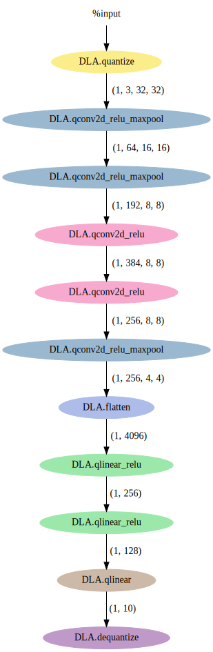
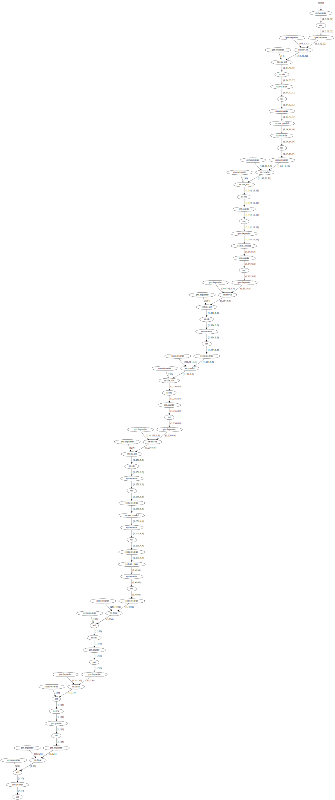
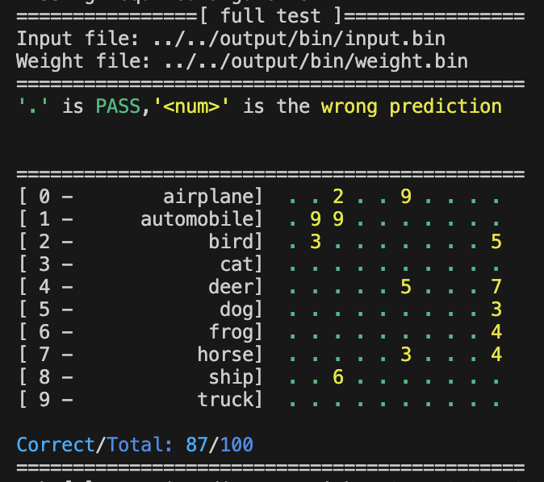
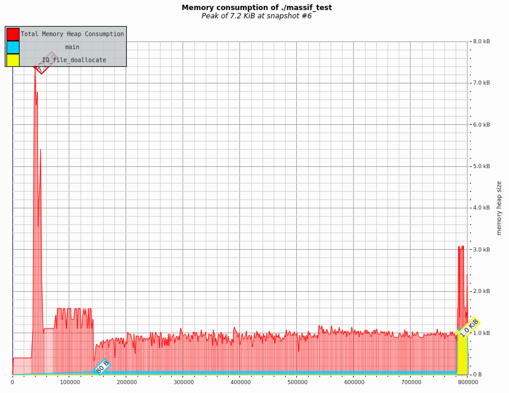

# Lab 5 Homework Template

## HW 5.1 Codegen with TVM compiler (40%)
### Complete the python script (30%)
- Explain how you implement `visit_call()` in `codegen.py`  
#### Code:  
```python
for arg, name in zip(call.args, tvm_auto_args_NOTES[func_name]):
            if isinstance(arg, Constant):
                parameters[name] = (arg, True)
            else:
                out = self.visit_expr(arg)[0]
                parameters[name] = (out, False)
```
#### Description:
```python
for arg, name in zip(call.args, tvm_auto_args_NOTES[func_name]):
```
- 使用 `zip` 同時遍歷 `call.args` 和 `tvm_auto_args_NOTES[func_name]`。
- `call.args` 是這個 composite function 被呼叫時傳入的參數們。
- `tvm_auto_args_NOTES[func_name]` 是一個已知的對應參數名稱的清單，用來標記每個參數的語義名稱（例如 "input", "weight", "bias"...）。
- 所以這一行的效果是：同時取得參數物件 (`arg`) 和對應的參數名稱 (`name`)。

```python
if isinstance(arg, Constant):
            parameters[name] = (arg, True)
        else:
            out = self.visit_expr(arg)[0]
            parameters[name] = (out, False)
```
- 判斷當前的參數 `arg` 是否是一個 `Constant。`
- 在 TVM 的 Relay 中，`Constant` 表示該值在圖中是固定的、不會變的，例如權重參數。
- 如果 `arg` 是 `Constant`，直接存取
- 如果 `arg` 不是 `Constant`，使用 `self.visit_expr(arg)` 遞迴地造訪這個 expression，取得它對應的值（或名稱）。
- 使用參數的語義名稱 `name` 作為 key，確保外部知道這個參數是什麼用途，並存進 `parameters` 字典中

### screen shot of Relay Graph using visuTVM (10%)
- Relay Graph before fuse PASS


- Relay Graph after fuse PASS


## HW 5.2 Simulation and Performance Analysis (50%)
### Inference model with CPU-only (25%)
- Screenshot the `test_full` result matrix, including Accuracy (%)


- Screenshot the massif-visualizer memory graph result, and record the pick memory usage in the report.

Memory Peak : 7.2 KiB

### Inference model with DLA (25%)

- Fill the statistic data in to the sheet.

    | Layer | Operation             | Cycles   | Time(ns) | Memory read | Memory write |
    |-------|-----------------------|----------|----------|-------------|--------------|
    |   1   |qconv2d_relu_maxpool   |  409685  | 2048425  |   16768     |    16384     |
    |   2   |qconv2d_relu_maxpool   |  3878716 | 19393580 |   277248    |    12288     |
    |   3   |qconv2d_relu           |  6721669 | 33608345 |   701952    |    24576     |
    |   4   |qconv2d_relu           |  8880251 | 44401255 |   934912    |    16384     |
    |   5   |qconv2d_relu_maxpool   |  5901435 | 29507175 |   623616    |    4096      |

- Bar chart of **Cycles per Layer**
    ```mermaid
    %%{init: {
    "themeVariables": {
        "xyChart": {
        "plotColorPalette": "#1783b5"
        }
    }
    }}%%
    xychart-beta
        title "Cycles per Layer"
        x-axis ["layer 1", "layer 2", "layer 3", "layer 4", "layer 5"]
        y-axis "Cycles"
        bar [409685, 3878716, 6721669, 8880251, 5901435]
    ```

- Bar chart of **Memory read per Layer**
    ```mermaid
    %%{init: {
    "themeVariables": {
        "xyChart": {
        "plotColorPalette": "#17b55e"
        }
    }
    }}%%
    xychart-beta
        title "Memory read per Layer"
        x-axis ["layer 1", "layer 2", "layer 3", "layer 4", "layer 5"]
        y-axis "Memory read (Btyes)"
        bar [16768, 277248, 701952, 934912, 623616]
    ```

- Bar chart of **Memory write per Layer**
    ```mermaid
    %%{init: {
    "themeVariables": {
        "xyChart": {
        "plotColorPalette": "#e4b311"
        }
    }
    }}%%
    xychart-beta
        title "Memory write per Layer"
        x-axis ["layer 1", "layer 2", "layer 3", "layer 4", "layer 5"]
        y-axis "Memory write (Btyes)"
        bar [16384, 12288, 24576, 16384, 4096]
    ```

- Compair to Lab2

| Layer | Lab | Latency | Memory read | Memory write |
| :-- | :-- | :-- | :-- | :-- |
| vgg8.conv0 | Lab2<br>Lab5 | 682496<br>409685 | 30720<br>16768 | 16384<br>16384 |
| vgg8.conv1 | Lab2<br>Lab5 | 4355712<br>3878716 | 468480<br>277248 | 12288<br>12288 |
| vgg8.conv2 | Lab2<br>Lab5 | 6779520<br>6721669 | 1033728<br>701952 | 24576<br>24576 |
| vgg8.conv3 | Lab2<br>Lab5 | 8992512<br>8880251 | 1377280<br>934912 | 16384<br>16384 |
| vgg8.conv4 | Lab2<br>Lab5 | 6054656<br>5901435 | 918528<br>623616 | 4096<br>4096 |

整體而言，Lab 5 的量測值與 Lab 2 解析式預測相當接近，唯獨 Latency & Memory read 較預估低，經過觀察推測是由於兩個 lab 在預估時使用不同的 $m$ 值，lab5 的 DLA 使用了較大的 $m$ 值，另一方面在 lab2 時我們推算出 `ifmap` 的 DRAM read：
$$
\text{DRAM reads for ifmap} = 
\overbrace{
    \left\lceil\frac{M}{m}\right\rceil 
}^\text{refetch DRAM} \times
\overbrace{
    \left\lceil\frac{E}{e}\right\rceil \times
    \left\lceil\frac{N}{n}\right\rceil \times
    \left\lceil\frac{C}{qr}\right\rceil
}^\text{num of tiles} \times
\overbrace{
    n \times qr \times (U(e-1) + R) \times W \times 1 \text{byte}
}^\text{tile size}
$$
根據 DRAM read 公式，$m$ 越大 DRAM read 會越小，而其他公式的 $m$ 值會被抵銷，比如下方的 DRAM write 公式：
$$
\text{DRAM writes for ofmap} =
\overbrace{
    \left\lceil\frac{M}{m}\right\rceil
}^\text{refetch DRAM} \times
{
    \left\lceil\frac{E}{e}\right\rceil \times
    \left\lceil\frac{N}{n}\right\rceil 
} \times
\overbrace{
    n \times m \times e \times F \times 1~ \text{byte}
}^\text{ofmap GLB usage}
$$

## Reflection (10%)
這次的 lab 像 lab4 一樣有比較多的資訊可以參考，讓實作的過程不會像 lab2 或 lab3 那樣起頭難，唯獨在一些細節的實作上還是缺乏具體的做法，像是 `note.py` 裡面的 `tvm_c_func_call_gen`，前面的幾個 operation 可以參照前面已經有的實作方式去推測需要的 params 有哪些，但到了 quantize/dequantize 時不僅講義沒有提到這部分的 params 的確切名稱是什麼，連其他周邊的程式碼裡面也沒有線索，真的只能靠自己瞎猜；另外還有 `fuse.py` 裡面的
`dfp.is_op("....")` 的 API 的名稱，這部分甚至要自己去 TVM 的官方網站看 Python API 才大概找得到我們要用的 operation 在 TVM 函式庫裡面的具體名稱，雖然說不寫在講義裡沒關係，但希望至少講義可以提示哪裡有這些資訊可以參考，不然老實說還是有可能讓我們花比較多的時間在通靈，這樣對學習其實沒有什麼正面的幫助，只是在虛耗我們的時間而已，對寫起作業的體驗也非常差。

相較於學期初的幾個 lab，最近兩次的 lab 在這個問題上已經減輕許多了，卻還是多少存在，可見前幾個問題比較嚴重的 lab 讓我們在實作的過程有多少的委屈，話就說到這裡。
